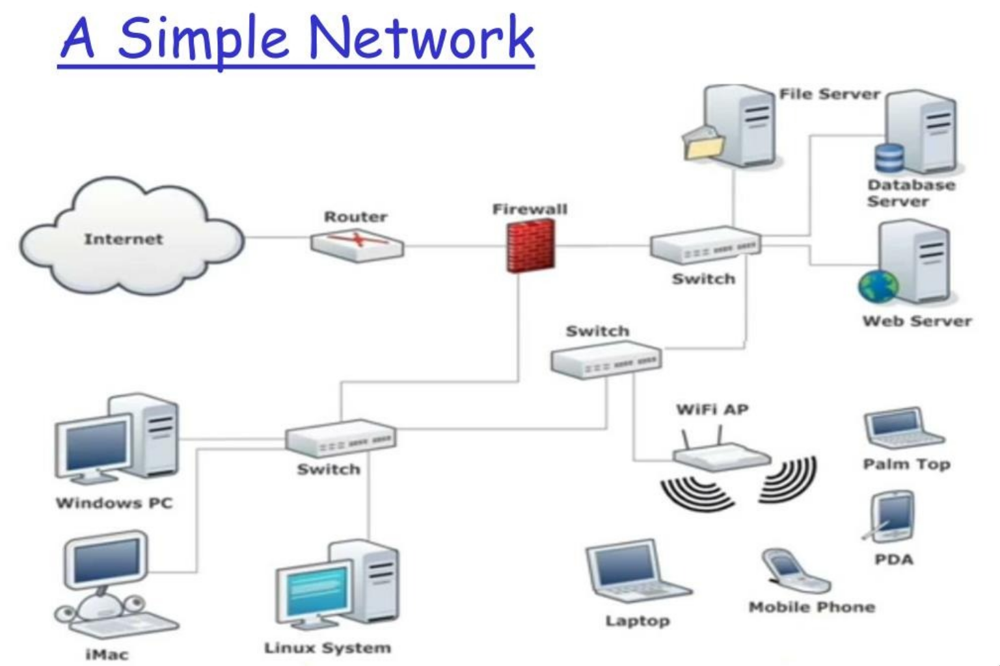
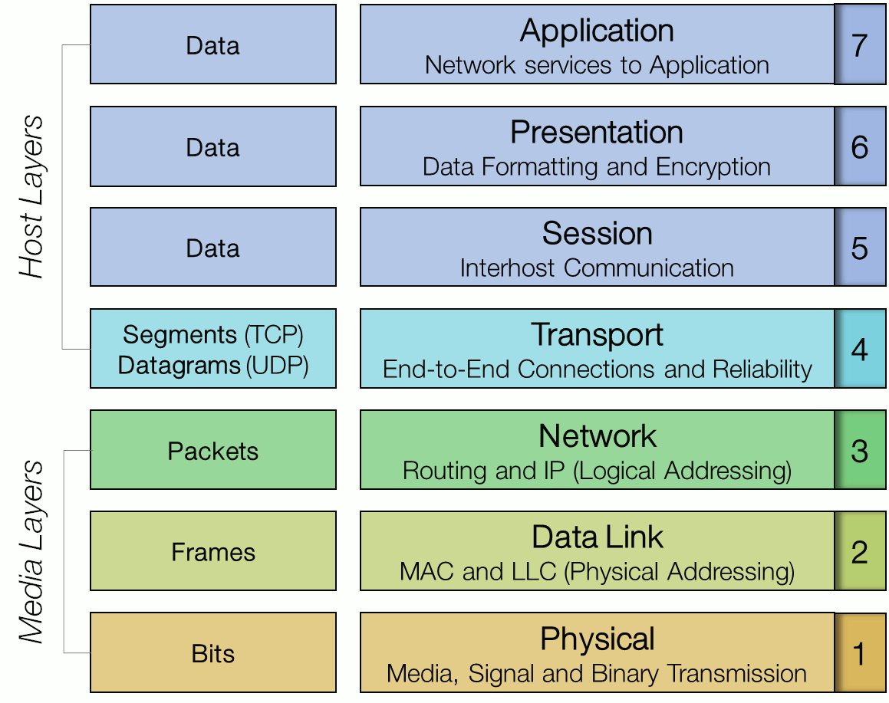
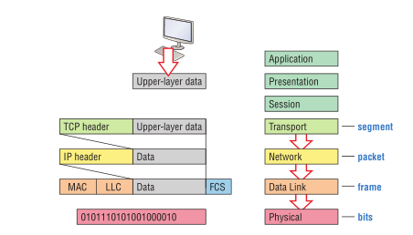
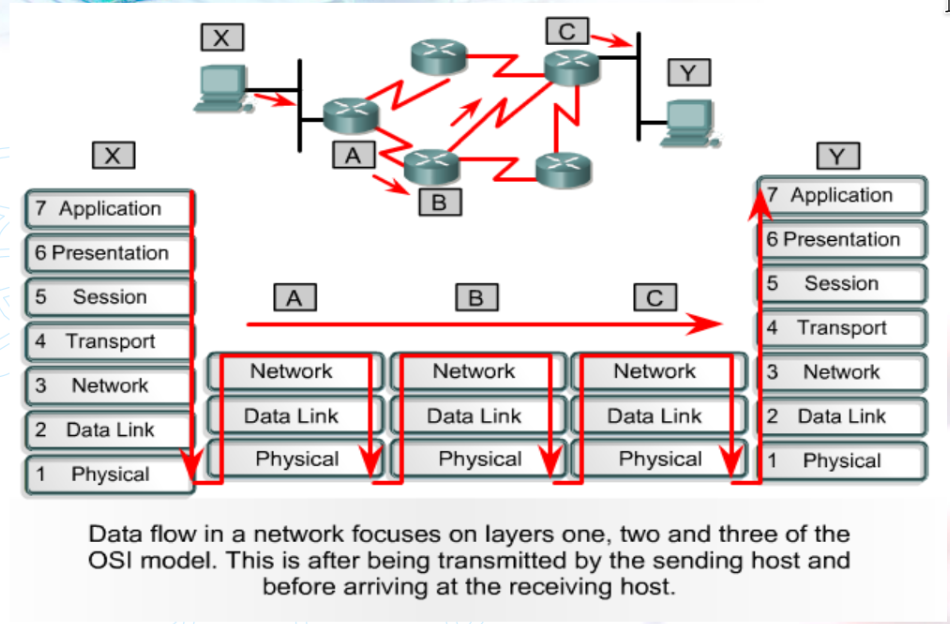
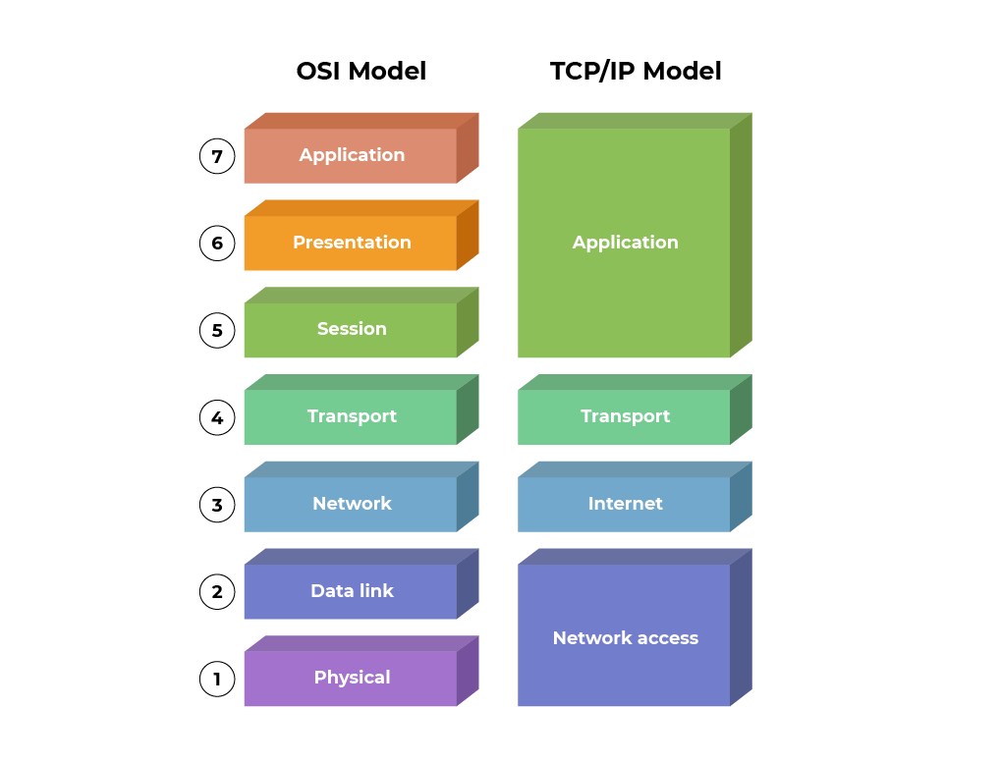
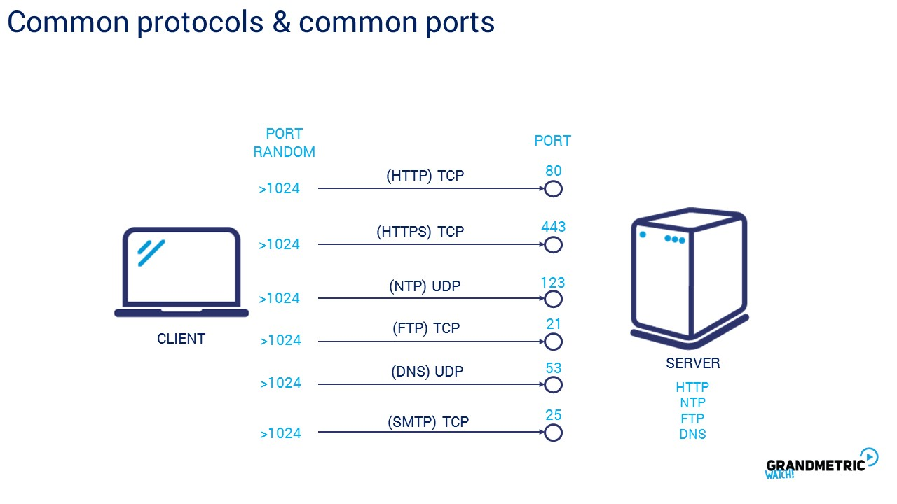

# Tổng quát

## 1\. Network protocol (giao thức mạng) là gì?

Tất cả các hoạt động giao tiếp trên Internet đều được quản lý bởi protocol.

> Giao thức xác định định dạng, thứ tự
> của tin nhắn được gửi và nhận
> giữa các thực thể mạng và hành động
> được thực hiện khi truyền, nhận tin nhắn.

## 2\. Mô hình tổng quát của mạng máy tính

## 2.1 Network edge

- Các hệ thống đầu cuối (end systems - host)
- Mô hình khách/chủ (client/server)
- Mô hình ngang cấp (peer to peer)

### 2.1.1 Network edge: connection-oriented service

- #### Handshaking (bắt tay ba bước):

    - SYN: Synchronize (đồng bộ)
    - ACK: Acknowledge (xác nhận)

- #### TCP service \[RFC 793\]

    - **Đáng tin cậy**, truyền dữ liệu theo luồng byte theo thứ tự
        - Khi mất dữ liệu sẽ: xác nhận và truyền lại (Acknowledgements and retransmissions)
    - **Flow control**: bên gửi sẽ không vượt quá bên nhận, đảm bảo rằng bên nhận sẽ không bị quá tải dữ liệu.
    - **Congestion control**: là một cơ chế giới hạn luồng gói tin tại mỗi nút của mạng. Có thể hiểu bên gửi sẽ giảm tốc độ gửi khi phát hiện tắt nghẽn mạng.
    - > 👉 An toàn hơn, dữ liệu được đảm bảo nguyên vẹn nhưng chậm hơn

### 2.1.2 Network edge: connectionless service

- #### UDP service \[RFC 768\]

    - Truyền dữ liệu **không đáng tin cậy**
    - **không** có kiểm soát luồng (flow control)
    - **không** có kiểm soát tắt nghẽn (congestion control)
    - > 👉 Nhanh hơn nhưng không an toàn, khả năng mất mát dữ liệu cao

### 2.1.3 Một số ứng dụng và giao thức được sử dụng

- **TCP**: HTTP, FTP, Telnet, SMTP,...
- **UDP**: streaming media, Tunneling/VPN, video call, online game,...

## 2.2 Network core

- Gồm nhiều thiết bị router kết nối liên thông
- Phục vụ chuyển dữ liệu từ máy này sang máy khác
- Dữ liệu truyền trên mạng bằng 2 phương pháp:
    - **Chuyển mạch** (circuit switching): mạng điện thoại
    - **Chuyển gói** (packet switching): dữ liệu đóng gói rồi truyền đi

### 2.2.1 Network core: circuit switching (chuyển mạch)

- Được sử dụng cho đường dây điện thoại
- Chuyển dữ liệu qua một mạch hoặc một kênh chuyên dụng
- Connection-oriented (hướng kết nối): Thiết lập một kết nối trước khi giao tiếp
- Một khi kết nối được thiết lập, kênh sẽ được giữ cho phiên giao tiếp, nghĩa là không có thiết bị nào khác được phép giao tiếp trên kênh này. Đến khi phiên kết thúc, kênh sẽ được nhường cho thiết bị khác.
- > 👉 Chất lượng tốt hơn và ổn định hơn rất nhiều nhưng kém linh hoạt (không thể truyền nhiều loại dữ liệu, không sử dụng hiệu quả băng thông do băng thông cố được cố định)

### 2.2.2 Network core: packet switching

- Được sử dụng để truyền dữ liệu qua internet
- Phân loại:
    - Connection-oriented (hướng kết nối): xác định đường đi bằng một gói, thông tin được lưu trong các chuyển mạch trên đường đi, các gói chỉ cần lưu ID
    - Connectionless (không kết nối): mỗi gói phải mang đầy đủ thông tin địa chỉ
        - Dữ liệu được chia thành các gói riêng lẻ và độc lập di chuyển đến đích (có thể đi bằng những con đường khác nhau)
        - Vì di chuyển độc lập nên các gói có thể sẽ đến đích không theo thứ tự, thiết bị nhận khi này phải tổng hợp các gói theo đúng thứ tự trước khi sử dụng.

## 2.3 Access network:

Thực hiện kết nối mạng ngoại biên (network edge) vào mạng:

- Nối thông qua mạng truy cập tại vùng cư trú
- Truy cập qua mạng di động
- Qua các mạng tại trường học, cơ quan

## 2.4 Physical media:

- có dây (digital / analog)
- không dây (radio / cellular - di di động)

> **Bandwidth** (bit per second) of access network: số lượng dữ liệu được truyền trên một đơn vị thời gian, đại diện cho tốc độ truyền dữ liệu của một đường truyền.

## 3\. Các thành phần của internet

- **ISP (Internet Service Provider)** - *important*
- IAP (Internet Access Provider)
- ICP (Internet Content Provider)
- User, Account
- Kết nối máy tính với internet

* * *

* * *

# Mô hình OSI - TCP/IP

# 1\. Mô hình OSI (Open Systems Interconnection)

## 1.1 Dòng dữ liệu trong mô hình OSI:

- **Application:** Ứng dụng tạo ra dữ liệu.
- **Presentation:** Dữ liệu được định dạng và mã hóa.
- **Session:** Thiết lập và quản lý các kết nối.
- **Transport:** Dữ liệu được chia thành các phân đoạn để truyền tải đáng tin cậy.
- **Network:** Các phân đoạn được đóng gói thành các gói và được định tuyến.
- **Data Link:** Các gói tin được đóng khung và gửi đến thiết bị tiếp theo.
- **Physical:** Khung được chuyển đổi thành bit và truyền đi theo cách vật lý.

## 1.2 Các lớp của mô hình OSI (7 lớp)

### 1.2.1 Physical (vật lý)

#### *Truyền dẫn nhị phân*

- Dây, đầu nối, điện áp
- Tốc độ truyền dữ liệu
- Phương tiện truyền dẫn
- Chế độ truyền dẫn (simplex, half-duplex, full-duplex)

### 1.2.2 Data Link (Liên kết dữ liệu)

#### *Điều khiển liên kết, truy xuất đường truyền*

- Đóng *frame*
- Ghi địa chỉ vật lý
- Điều khiển luồng
- Kiểm soát lỗi, thông báo lỗi

### 1.2.3 Network (Mạng)

#### *Địa chỉ mạng và xác định đường đi tốt nhất*

- Tin cậy
- Địa chỉ luận lý, topo mạng
- Định tuyến (tìm đường đi) cho gói tin

### 1.2.4 Transport (Vận chuyển)

#### *Kết nối end-to-end*

- Vận chuyển giữa các host
- Vận chuyển tin cậy
- Thiết lập, duy trì, kết nối các mạch ảo
- Phát hiện lỗi, phục hồi thông tin và điều khiển luồng

### 1.2.5 Session (Phiên)

#### *Truyền thông liên host*

- Thiết lập, quản lý và kết thúc các phiên giữa các ứng dụng

### 1.2.6 Presentation (Trình bày)

#### *Trình bày dữ liệu*

- Định dạng dữ liệu
- Cấu trúc dữ liệu
- Mã hóa
- Nén dữ liệu

### 1.2.7 Application (Ứng dụng)

#### *Các quá trình mạng của ứng dụng*

- Xác định giao diện giữa người sử dụng và môi trường tham chiếu OSI
- Cung cấp các dịch vụ mạng cho các ứng dụng như email, truyền file,...

## 1.3 Lưu ý:

#### Những lớp này chỉ tồn tại trong máy nguồn và máy đích:

- Application
- Presentation
- Session
- Transport

#### Những lớp này quản lý thông tin di chuyển trong mạng LAN/WAN giữa máy nguồn và máy đích:

- Network
- Data Link
- Physical

# 2\. Mô hình TCP/IP

## 2.1 Các lớp của mô hình TCP/IP

 

### 2.1.1 Application (Lớp ứng dụng)

Kiểm soát các giao thức lớp cao, các chủ đề về trình bày, biểu diễn thông tin, mã hóa và điều khiển hội thoại. Đặc tả cho các ứng dụng phổ biến.

### 2.1.2 Transport (Vận chuyển)

Cung ứng dịch vụ vận chuyển từ host nguồn đến host đích. Thiết lập một cầu nối luận lý giữa các đầu cuối của mạng, giữa host truyền và host nhận.

### 2.1.3 Internet

Mục đích của lớp Internet là chọn đường đi tốt nhất xuyên qua mạng cho các gói dữ liệu di chuyển tới đích. Giao thức chính của lớp này là Internet Protocol (IP).

### 2.1.4 Network Access (Lớp truy cập mạng)

Định ra các thủ tục để giao tiếp với phần cứng mạng và truy nhập môi trường truyền. Có nhiều giao thức hoạt động tại lớp này:

- Ethernet
- Fast Ethernet
- SLIP & PPP
- FDDI
- ATM, Fram Relay & SMDS
- ARP
- Proxy ARP
- RARP

* * *

* * *
